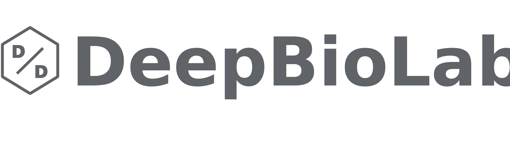

# DeepBioLab

**DeepBioLab** is an interactive platform designed for AI enthusiasts, researchers, and developers working at the intersection of artificial intelligence and biological sciences. The website provides a collaborative space to explore and dive into cutting-edge AI algorithms, including deep learning, machine learning, reinforcement learning, and their applications in biology and other scientific domains.

## Key Features

- **Blog**: Dive into detailed blog posts covering topics like generative AI, reinforcement learning, and computer vision. Stay updated with the latest research, papers, and AI-related tutorials.

- **Repositories**: Explore repositories for various AI projects, from deep learning models to biology-related AI innovations. Each repository contains detailed project information and implementation guidelines.

- **Research Highlights**: Discover key publications, papers, and projects within the AI community. Gain insights into how AI is transforming scientific research, with a focus on biological applications.

- **Categories & Tags**: The platform offers organized browsing through categories such as AI, programming, business, and more. Users can easily navigate content using tags like language-models, vision-models, algorithms, robotics, and productivity.

- **AI4Science**: A dedicated section for AI for science, exploring how artificial intelligence is being used to address fundamental challenges in biology, chemistry, and physics.

- **Project Categorization**: All projects are neatly categorized into multiple areas like deep learning, machine learning, bioprocess development, antibody design, and more.

- **Interactive Elements**: The website supports rich interaction with embedded images, videos, and responsive elements for a smooth user experience.

## License

This website is licensed under the [MIT License](LICENSE).

